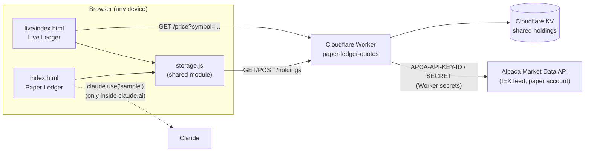

# Paper Ledger

A hands-on stock tracker for learning what gain, loss, and portfolio mix actually
look like — log a ticker, its share count, and a buy price, and watch the
numbers move as the price changes. No signup, no brokerage login required to
use it.

Two versions live side by side, sharing the same saved holdings:

- **[Paper Ledger](index.html)** (`/`) — prices are typed in by hand, or filled
  in approximately by Claude when the page is opened inside claude.ai.
- **[Live Ledger](live/index.html)** (`/live/`) — prices are pulled for real
  from an Alpaca **paper-trading** (simulated money) account, so the numbers
  reflect the actual market.

Live site: https://siddsapa-afk.github.io/paper-ledger/

## Architecture



- **GitHub Pages** serves the static frontend (`index.html`, `live/index.html`,
  `storage.js`) directly from this repo's `main` branch — no build step.
- **`storage.js`** is the one place both pages talk to for reading/writing the
  portfolio. It always tries the Worker first; if that fails (offline, Worker
  down), it falls back to a local browser cache so the page still shows
  something, and re-syncs once the Worker is reachable again.
- **The Cloudflare Worker** (`worker/`, deployed separately from Pages via
  `wrangler`) is the only thing that holds secrets or talks to Alpaca. It
  never ships to the browser.
- **Cloudflare KV** holds the actual holdings data (one shared JSON document),
  which is what makes the portfolio the same across every browser and device.
- **Claude's `sample` capability** (Paper Ledger only) is a page asking Claude,
  from inside the claude.ai viewer, for its best-guess approximate price. It
  only works when the page is embedded in the claude.ai app, not as a plain
  browser tab — see [Known limitations](#known-limitations).

## Functionality

- **Add a holding**: ticker, share count, and a buy price (typed in, or
  fetched with the ↻ button).
- **Stat tiles**: total invested, current value, total gain/loss, and overall
  return %.
- **Holdings table**: editable "price today" per row, with a status caption
  (`≈ estimate`, `● live`, or `entered by you`) and a gain/loss pill.
- **Charts**: a diverging bar chart of gain/loss per holding, and a stacked
  bar showing portfolio mix by value, both with hover tooltips.
- **Cross-device sync**: the same holdings list on any browser or computer
  that opens either page (see [Architecture](#architecture)).

### Data model

Each holding stored via the Worker looks like:

```json
{
  "id": "seed-aapl",
  "ticker": "AAPL",
  "shares": 5,
  "buyPrice": 150,
  "currentPrice": 227.5,
  "priceSource": "live",
  "priceAsOf": "2026-09-04T19:59:56Z"
}
```

`priceSource` is `"manual"`, `"estimate"` (Claude), or `"live"` (Alpaca) — used
only to choose which caption to show.

## Worker (`worker/`)

Cloudflare Worker source, deployed independently of GitHub Pages.

| Endpoint | Method | Purpose |
|---|---|---|
| `/price?symbol=TSLA` | GET | Real last-trade price from Alpaca's Market Data API (IEX feed), using the Worker's own Alpaca paper-account keys |
| `/holdings` | GET | Returns the shared portfolio from KV; seeds two example holdings on the very first-ever call |
| `/holdings` | POST | Replaces the shared portfolio (server-side validated: shape, types, a 50-holding cap, 50 KB body cap) |

CORS is restricted to `https://siddsapa-afk.github.io`. Alpaca credentials are
stored as encrypted Worker secrets (`APCA_API_KEY_ID`, `APCA_API_SECRET_KEY`)
— they exist only in Cloudflare, never in this repo or the browser.

### Deploying the Worker

```
cd worker
npx wrangler login                          # once, per machine
npx wrangler secret put APCA_API_KEY_ID     # your Alpaca paper-trading key
npx wrangler secret put APCA_API_SECRET_KEY # your Alpaca paper-trading secret
npx wrangler deploy
```

The KV namespace binding is already in `worker/wrangler.toml`.

## Known limitations

- **Not a real trading connection.** This reads prices from a paper-trading
  account; it never places orders or reflects real money.
- **IEX-only market data.** Alpaca's free tier sees one exchange (IEX), so
  prices can be a few cents off from the full consolidated tape (Yahoo,
  Google Finance, etc.) — fine for learning, not for trading against.
- **Claude's price estimates only work inside claude.ai.** The `sample`
  capability that powers Paper Ledger's ↻ buttons requires the page to be
  framed inside the claude.ai app; opened as a plain browser tab (like the
  GitHub Pages link), it always falls back to manual entry.
- **No access control on `/holdings`.** Anyone who has the Worker's URL could
  read or overwrite the shared portfolio — acceptable for a two-person family
  project, not for anything with real stakes.
- **Last write wins.** If two devices save at nearly the same moment, the
  later save overwrites the earlier one; there's no merge or conflict
  handling.
